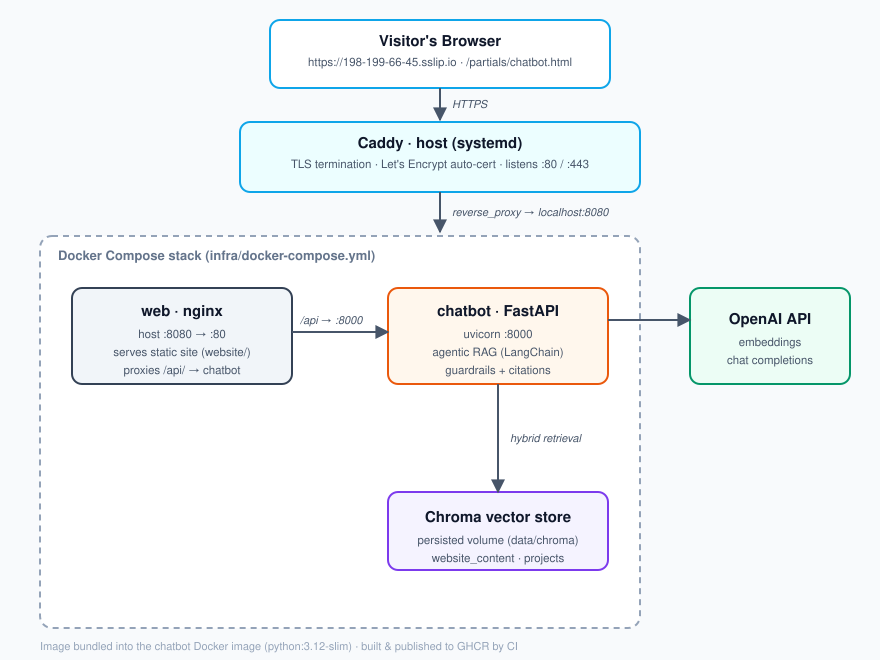

# Oswald Portfolio Chatbot — Architecture & Operations

A complete walkthrough of how the app is built and how it runs — from code to the live HTTPS site.

## 1. What it is

An **agentic RAG (Retrieval-Augmented Generation) chatbot** for the portfolio. A visitor asks a
question; an LLM agent decides whether to search the *bio/website* content or the *project* docs,
retrieves the most relevant chunks from a vector database, and answers **grounded in real content**
with citations — refusing to invent facts it can't support.

Two deployable pieces:
- a **Python FastAPI backend** (the brain), and
- a **static website frontend** (the portfolio + chat widget),

tied together by **nginx** and served over **HTTPS** on a cloud VM.

## 2. High-level architecture



The same flow in text:

```
                        Internet (HTTPS)
                              │
                  https://198-199-66-45.sslip.io
                              │
                    ┌─────────▼─────────┐
                    │   Caddy (host)    │   :80/:443 — TLS termination,
                    │  Let's Encrypt    │             auto cert + renewal
                    └─────────┬─────────┘
                              │ reverse_proxy → localhost:8080
        ┌─────────────────────▼──────────────────────┐
        │      Docker Compose stack (infra/)          │
        │                                             │
        │   ┌──────────────┐      ┌────────────────┐  │
        │   │  web (nginx) │      │ chatbot        │  │
        │   │  :80 → :8080 │      │ (FastAPI/      │  │
        │   │  serves      │ /api │  uvicorn :8000)│  │
        │   │  static site ├─────►│  agentic RAG   │  │
        │   └──────────────┘      └───────┬────────┘  │
        │                                 │           │
        │                   ┌─────────────▼─────────┐ │
        │                   │ Chroma vector store   │ │
        │                   │ (persisted volume)    │ │
        │                   └───────────────────────┘ │
        └─────────────────────────────────────────────┘
                              │
                              ▼  (embeddings + chat completions)
                         OpenAI API
```

**Key design choice:** nginx proxies `/api/` to the backend, so the site and API are
**same-origin** — the browser needs no CORS for the on-VM site, and the widget calls a relative
`/api/v1/chat`.

## 3. Components in detail

### A. Backend — FastAPI agentic RAG (`chatbot/`)
- **Entrypoint:** [chatbot/app/main.py](chatbot/app/main.py) — creates the FastAPI app, adds CORS
  middleware, and warms the agent on startup. Runs under `uvicorn app.main:app` on port 8000.
- **API route:** [chatbot/app/api/routes.py](chatbot/app/api/routes.py) — `POST /api/v1/chat`,
  takes `{message, history, session_id}`, returns `{answer, sources, tool_calls, session_id}`.
- **The agent:** [chatbot/app/agents/orchestrator.py](chatbot/app/agents/orchestrator.py) — a
  LangChain agent (`ChatOpenAI`, default `gpt-4o-mini`) with two tools:
  - `search_about_me` → the `website_content` collection (bio, skills, contact)
  - `search_projects` → the `projects` collection (deep project docs)

  Uses **hybrid retrieval** (dense embedding similarity + lexical overlap), records every retrieved
  chunk as a **citation** (request-scoped `contextvars`), and runs an **output verifier**
  (`verify_answer`) that refuses unverifiable factual claims.
- **Config:** [chatbot/app/config.py](chatbot/app/config.py) — pydantic-settings loaded from `.env`.
  Requires a real `OPENAI_API_KEY`. Holds model names, Chroma path, collection names, `retrieval_k`,
  CORS origins.

### B. RAG & data
- **Vector store:** [chatbot/app/rag/vectorstore.py](chatbot/app/rag/vectorstore.py) — Chroma,
  persisted to `data/chroma`, OpenAI embeddings (`text-embedding-3-small`).
- **Ingestion:** [chatbot/app/rag/ingestion.py](chatbot/app/rag/ingestion.py) + CLI
  [chatbot/scripts/ingest.py](chatbot/scripts/ingest.py) — `load_projects()` ingests **`.md`,
  `.docx`, `.pptx`, and `.png`** files in `data/projects/`: markdown/docx split on headings, pptx
  slide text plus embedded slide images captioned via OpenAI vision, and standalone images via
  vision caption + OCR (OCR needs `tesseract` in the image; vision works regardless). The `website`
  mode scrapes a live URL. Note: `add_documents` **appends** (no dedup) — clear the Chroma index
  before a full re-ingest to avoid duplicate chunks.

### C. Guardrails (security hardening)
- [chatbot/app/utils/sanitizer.py](chatbot/app/utils/sanitizer.py) — detects/strips prompt-injection.
- [chatbot/app/prompts/renderer.py](chatbot/app/prompts/renderer.py) — neutral wrapper around the
  user message before it reaches the model.
- [chatbot/app/schemas.py](chatbot/app/schemas.py) — request validation rejecting suspicious input.
- Plus the `verify_answer` refusal policy in the orchestrator.

### D. Frontend — static site (`website/`)
- [website/index.html](website/index.html) — the portfolio, with a floating launcher button.
- [website/partials/chatbot.html](website/partials/chatbot.html) — the **full-page avatar chatbot**:
  orange panel, `OzChatGPTLogo.png`, pulsing rings, chat area, markdown + Mermaid rendering.
- [website/static/js/chatbot-widget.js](website/static/js/chatbot-widget.js) — vanilla JS; detects
  homepage (launcher → opens the avatar page) vs the avatar page (wires the chat form), POSTs to the
  chat API.

### E. Infrastructure
- [infra/docker-compose.yml](infra/docker-compose.yml) — `chatbot` (built from the Dockerfile) +
  `web` (nginx). Persists `data/chroma`; mounts the static site read-only into nginx.
- [infra/nginx/default.conf](infra/nginx/default.conf) — serves the static site, reverse-proxies
  `/api/` → `chatbot:8000`.
- [chatbot/Dockerfile](chatbot/Dockerfile) — `python:3.12-slim`, installs requirements, copies
  `app/`, `scripts/`, `data/projects/`, runs uvicorn.

## 4. How it was put together (build steps)

1. **Code structure** — standard FastAPI package (`app/` with `api`, `agents`, `rag`, `prompts`,
   `utils`), a `scripts/` ingestion CLI, and a `tests/` suite (pytest).
2. **Dependencies** split into runtime (`chatbot/requirements.txt`) and dev tooling
   (`requirements-dev.txt`: ruff, black, pytest).
3. **Quality gates** — `chatbot/pyproject.toml` configures ruff + black (line length 88);
   `.pre-commit-config.yaml` mirrors them.
4. **Containerization** — the Dockerfile bakes the app + project docs into an image; Compose wires
   it to nginx with a persisted Chroma volume.
5. **CI/CD** — [.github/workflows/ci-cd.yml](.github/workflows/ci-cd.yml): on push/PR runs
   **lint → test → validate-compose**; on `main` **builds & pushes the image to GHCR** then
   **deploys via SSH**. (Pipeline exists; current deploys are manual — see §8.)

## 5. How it was deployed (actual steps)

1. **Provisioned** a DigitalOcean Droplet — Ubuntu 24.04, 2 vCPU / 4 GB, `nyc1`, IP `198.199.66.45`.
   Firewall opened for 22, 80, 443, 8080.
2. **Host prep** (SSH): installed Docker + Compose; created a non-root `deploy` user in the `docker`
   group; added a dedicated CI SSH key; cloned the repo to `/opt/oswalddurand`.
3. **Secrets:** placed the production `OPENAI_API_KEY` in `/opt/oswalddurand/chatbot/.env`
   (mode 600, never committed); logged the host into **GHCR** (image stays private — it bundles
   project docs).
4. **Launched the stack:** `docker compose up -d --build` from `infra/`.
5. **Populated the index:** ran ingestion in-container — `projects` (63 chunks) and
   `website https://ozdurand.github.io/oswalddurand/` (9 chunks).
6. **Synced the frontend:** copied current `index.html`, `partials/chatbot.html`,
   `chatbot-widget.js`, and `OzChatGPTLogo.png` to the host.
7. **Added HTTPS:** installed **Caddy** on the host as a TLS reverse proxy
   (`/etc/caddy/Caddyfile` → `reverse_proxy localhost:8080`) for `198-199-66-45.sslip.io`. Caddy
   auto-obtained a **Let's Encrypt** certificate, serving on 80/443.

## 6. End-to-end request flow (runtime)

1. Browser loads `https://198-199-66-45.sslip.io/` → Caddy terminates TLS → nginx (`:8080`) serves
   the static portfolio.
2. Visitor opens the avatar chatbot and types a question; the widget `POST`s to `/api/v1/chat`.
3. Caddy → nginx → nginx proxies `/api/` to the **chatbot container** (`:8000`).
4. FastAPI sanitizes/validates input, invokes the **agent**.
5. The agent picks `search_about_me` or `search_projects`, runs **hybrid retrieval** against
   **Chroma**, records chunks as citations.
6. It calls **OpenAI** for embeddings (retrieval) and a chat completion (the answer), runs the
   **refusal check**, returns `{answer, sources}`.
7. The widget renders the answer (markdown/Mermaid) with a **Sources** list.

## 7. How it runs day-to-day (process model)

- **Caddy** runs as a host **systemd service** (auto-starts on boot, auto-renews TLS).
- **chatbot** and **web** run as **Docker containers** with `restart: unless-stopped` — they survive
  crashes and reboots.
- **Chroma data** lives in a host-mounted volume (`/opt/oswalddurand/chatbot/data/chroma`),
  persisting across container rebuilds.
- **Secrets** (`OPENAI_API_KEY`) live only in the host `.env`, read by Compose at container start.

## 8. CI/CD status

The pipeline is fully built, but **deploys are currently manual** (via SSH). Reason: GitHub `main`
is an *unrelated* GitHub Pages history (the old static site), so pushing the chatbot project to
`main` would clobber it. The chatbot code lives on the `feat/ci-cd-pipeline` branch. Open follow-up:
point the workflow at a dedicated deploy branch so merges auto-deploy without touching Pages.

## 9. Operations cheat-sheet

```bash
# SSH in (as the deploy user, with the CI key)
ssh -i ~/.ssh/deploy_oswald_ci deploy@198.199.66.45
cd /opt/oswalddurand/infra

docker compose ps                 # status of chatbot + web
docker compose logs -f chatbot    # tail backend logs
docker compose restart chatbot    # restart backend (needed after re-ingesting)
docker compose up -d --build      # rebuild & restart after code changes

# Re-index content (then restart chatbot so it sees new collections):
docker compose exec chatbot python -m scripts.ingest projects
docker compose exec chatbot python -m scripts.ingest website https://your-site
docker compose restart chatbot

# Caddy / HTTPS (run as root)
systemctl status caddy            # TLS proxy status
cat /etc/caddy/Caddyfile          # the reverse-proxy config
```

**Live URLs:** site `https://198-199-66-45.sslip.io/` · avatar chatbot
`https://198-199-66-45.sslip.io/partials/chatbot.html`
